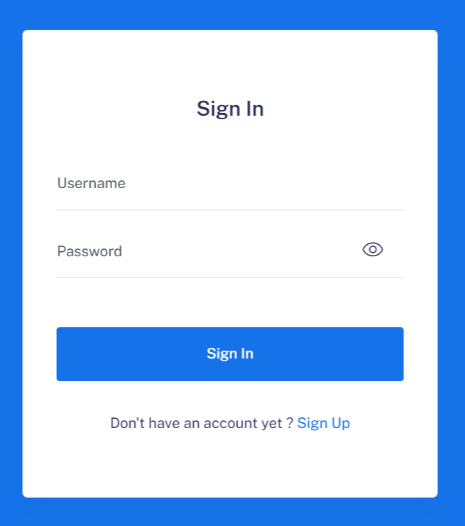
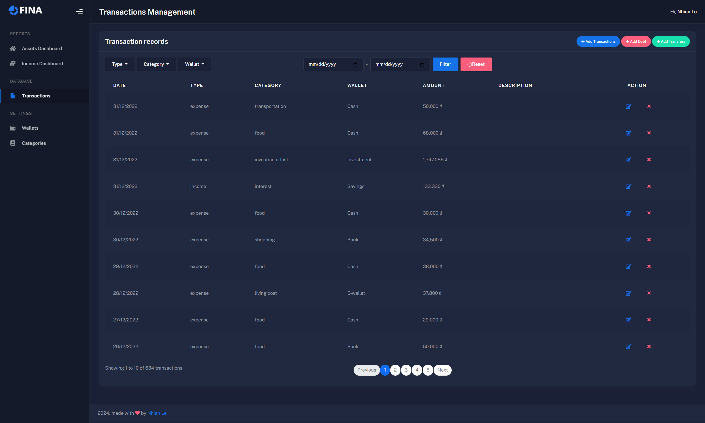
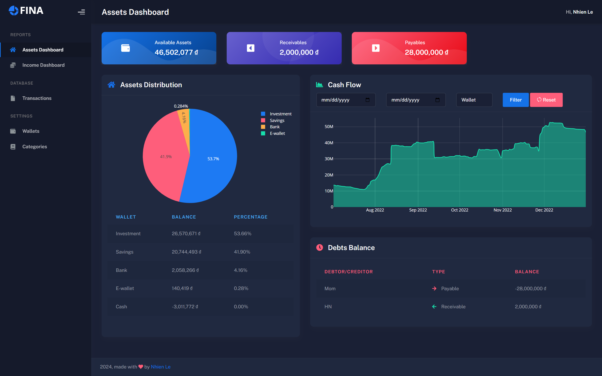
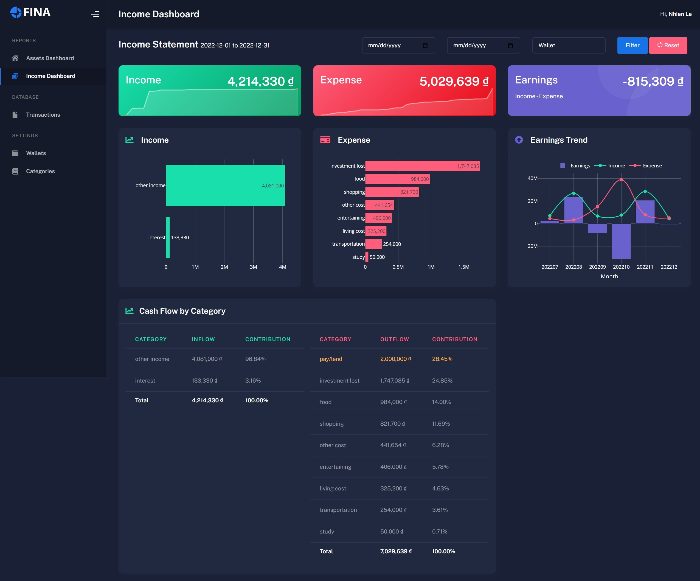

# FINA – Personal Finance Management Web App

**FINA** is a web-based personal finance management tool that helps users track and analyze their financial activities. Built with **HTML**, **CSS**, **JavaScript**, and **Python**. This app allows users to manage their finances effectively by tracking transactions, assets, debts, and more.

## Table of Contents
1. [Features](#features)
2. [Technology Stack](#technology-stack)
3. [Usage](#usage)
4. [Screenshots](#screenshots)
5. [Further Development](#further-developement)

## Features

- **User Authentication:** Secure user login and registration with hashed password and initial setup of wallets and categories.
- **Assets & Debts Management:** Supports two types of wallets: **Asset Wallets** (e.g., cash, bank accounts) and **Debt Wallets** (e.g., loans).
- **Transaction Management:** Add, edit, and delete **daily transactions**, **debt transactions**, and **transfers** between wallets.
- **Customizable Categories:** Create or modify transaction categories to fit personal financial tracking needs.
- **Dashboards for Analysis:**
  - **Assets Dashboard:** Displays current asset balances, receivables, payables, and trends.
  - **Income Dashboard:** Tracks income, expenses, and net earnings, with charts to analyze financial behavior over time.
- **Theme Switching:** Easily toggle between **light and dark modes**.
- **Profile Management:** Update account details as needed.

## Technology Stack

- **Backend:** Python (FastAPI)
- **Frontend:** HTML, CSS, JavaScript
- **Database:** SQLite
- **Libraries and Frameworks:** 
    - **Python**: Pandas, Numpy, sqlAlchemy, FastAPI, werkzeug, Plotly
    - **CSS**: Bootstrap
    - **JavaScript**

## Usage

1. **Register for an account** if you're a new user.
2. **Set up your wallets** and customize the initial settings to reflect your financial context.
3. **Start tracking transactions** in the Transactions page.
4. **Use the dashboards** to analyze your financial data and identify trends.

## Screenshots
**Login & Signup Page**

 

**Transactions Page**

    

**Assets Dashboard**

    

**Income Dashboard**

    

## Further Development

To enhance the functionality and make FINA a more comprehensive personal finance management tool, several features can be added in future versions. These additions would provide more value to users by helping them plan their finances better and gain insights into their financial behavior. Below are some ideas for further development:

### 1. Budgeting Features
Adding budgeting capabilities would allow users to set financial goals and track their progress over time. Potential features include:
- **Monthly Budgets:** Enable users to set monthly budgets for different categories.
- **Budget Tracking:** Display real-time tracking of spending against the set budgets, showing how much is left in each budget category.
- **Alerts and Notifications:** Notify users when they are approaching or exceeding their budget limits.
- **Savings Goals:** Allow users to set savings targets and track their progress towards meeting these goals.

### 2. Financial Behavior Analysis
Integrating advanced analytics to help users understand their financial habits would provide valuable insights and assist with better financial planning:
- **Spending Trends:** Analyze spending patterns over time to identify where the majority of expenses occur and how they change month by month.
- **Predictive Analysis:** Use historical data to predict future spending and potential cash flow issues, helping users anticipate and prepare for upcoming expenses.
- **Financial Health Score:** Introduce a scoring system based on various financial metrics such as savings rate, debt-to-income ratio, and budget adherence. Provide recommendations for improving the score.
